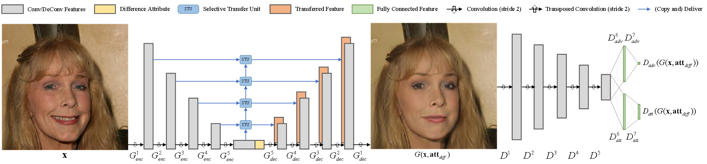
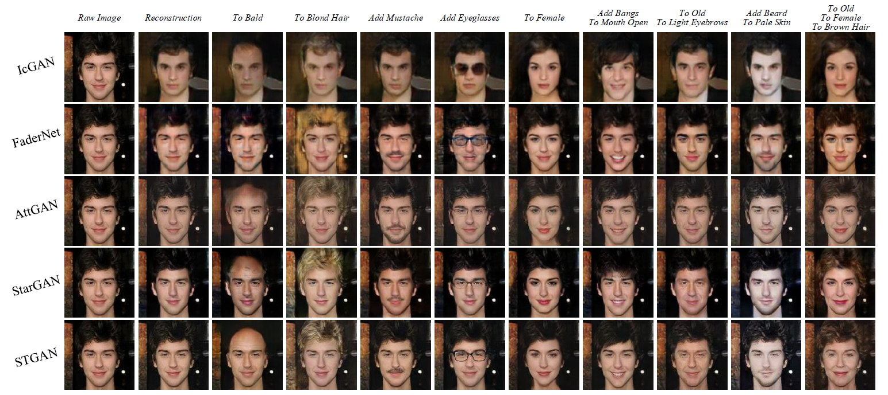
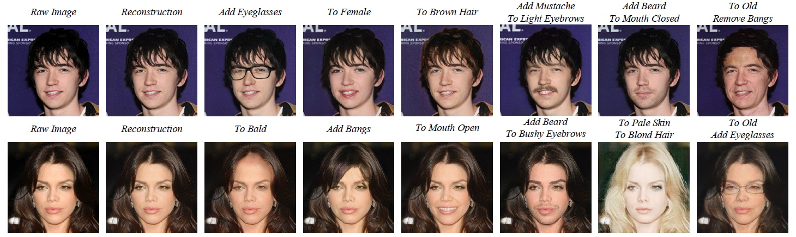
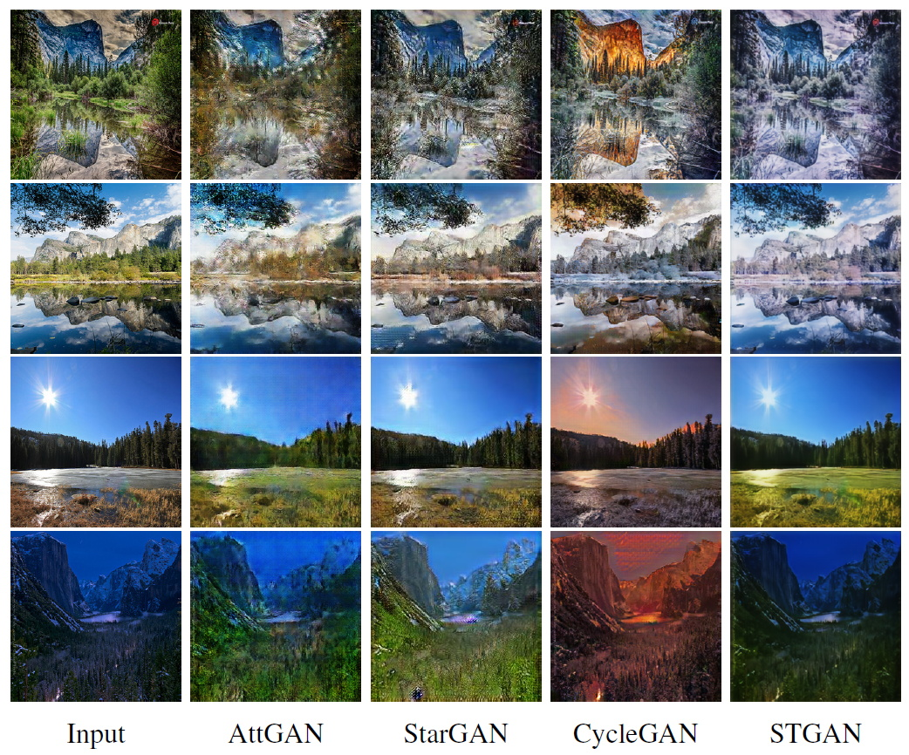

# STGAN

**Tensorflow** implementation of [**STGAN: A Unified Selective Transfer Network for Arbitrary Image Attribute Editing**]()

<p align="center"> <br><center>Overall architecture of our STGAN. Taking the image above as an example, in the difference attribute vector <a href="http://latex.codecogs.com/gif.latex?\mathbf{att}_\mathit{diff}"></a>, <a href="http://latex.codecogs.com/gif.latex?Young"></a> is set to 1, <a href="http://latex.codecogs.com/gif.latex?Mouth\%20Open"></a> is set to -1, and others are set to zeros. The outputs of <a href="http://latex.codecogs.com/gif.latex?\mathit{D_{att}}"></a> and <a href="http://latex.codecogs.com/gif.latex?\mathit{D_{adv}}"></a> are the scalar <a href="http://latex.codecogs.com/gif.latex?\mathit{D_{adv}}(\mathit{G}(\mathbf{x},\mathbf{att}_\mathit{diff}))"></a> and the vector <a href="http://latex.codecogs.com/gif.latex?\mathit{D_{att}}(\mathit{G}(\mathbf{x},\mathbf{att}_\mathit{diff}))"></a>, respectively</center></p>

## Exemplar Results

- See [results.md](./results.md) for more results

- Facial attribute editing results

    <p align="center"><br><center>Facial attribute editing results on the CelebA dataset. The rows from top to down are results of <a href="https://github.com/Guim3/IcGAN" target="_blank" title="IcGAN@Guim3">IcGAN</a>, <a href="https://github.com/facebookresearch/FaderNetworks" target="_blank" title="FaderNet@facebookresearch">FaderNet</a>, <a href="https://github.com/LynnHo/AttGAN-Tensorflow" target="_blank" title="AttGAN@LynnHo">AttGAN</a>, <a href="https://github.com/yunjey/stargan" target="_blank" title="StarGAN@yunjey">StarGAN</a> and STGAN.</center></p>
    <p align="center"><br><center>High resolution (<a href="http://latex.codecogs.com/gif.latex?384\times384"></a>) results of STGAN for facial attribute editing.</center></p>
    
- Image translation results

    <p align="center"><br><center>Results of season translation, the top two rows are <a href="http://latex.codecogs.com/gif.latex?summer%20\rightarrow%20winter"></a>, and the bottom two rows are <a href="http://latex.codecogs.com/gif.latex?winter%20\rightarrow%20summer"></a>.</center></p>

## Preparation

- **Prerequisites**
    - Tensorflow (r1.4 - r1.12 should work fine)
    - Python 3.x with matplotlib, numpy and scipy

- **Dataset**
    - [CelebA](http://openaccess.thecvf.com/content_iccv_2015/papers/Liu_Deep_Learning_Face_ICCV_2015_paper.pdf) dataset (Find more details from the [project page](http://mmlab.ie.cuhk.edu.hk/projects/CelebA.html))
        - [Images](https://drive.google.com/open?id=0B7EVK8r0v71pZjFTYXZWM3FlRnM) should be placed in ***DATAROOT/img_align_celeba/\*.jpg***
        - [Attribute labels](https://drive.google.com/open?id=0B7EVK8r0v71pblRyaVFSWGxPY0U) should be placed in ***DATAROOT/list_attr_celeba.txt***
        - If google drive is unreachable, you can get the data from [Baidu Cloud](http://pan.baidu.com/s/1eSNpdRG)
    - We follow the settings of AttGAN, kindly refer to [AttGAN](https://github.com/LynnHo/AttGAN-Tensorflow) for more dataset preparation details

- **pre-trained model**
    - download the model from [Google Drive](https://drive.google.com/open?id=1329IbLE6877DcDUut1reKxckijBJye7N) or [Baidu Cloud (4qeu)](https://pan.baidu.com/s/1D43d_8oER8_Xm4P9SovvuQ), and unzip the files to ***./output/***,

## Quick Start

Exemplar commands are listed here for a quick start.

### Training

- for 128x128 images

    ```console
    python train.py --experiment_name 128
    ```

- for 384x384 images (please prepare data according to [HD-CelebA](https://github.com/LynnHo/HD-CelebA-Cropper))

    ```console
    python train.py --experiment_name 384 --img_size 384 --enc_dim 48 --dec_dim 48 --dis_dim 48 --dis_fc_dim 512 --n_sample 24 --use_cropped_img
    ```

### Testing

- Example of testing ***single*** attribute

    ```console
    python test.py --experiment_name 128 [--test_int 1.0]
    ```

- Example of testing ***multiple*** attributes

    ```console
    python test.py --experiment_name 128 --test_atts Pale_Skin Male [--test_ints 1.0 1.0]
    ```

- Example of ***attribute intensity control***

    ```console
    python test.py --experiment_name 128 --test_slide --test_att Male [--test_int_min -1.0 --test_int_max 1.0 --n_slide 10]
    ```

The arguments in `[]` are optional with a default value.

### NOTE:

- You should give the path of the data by adding `--dataroot DATAROOT`;
- You can specify which GPU to use by adding `--gpu GPU`, e.g., `--gpu 0`;
- You can specify which image(s) to test by adding `--img num` (e.g., `--img 182638`, `--img 200000 200001 200002`), where the number should be no larger than 202599 and is suggested to be no smaller than 182638 as our test set starts at 182638.png.
- You can modify the model by using following arguments
    - `--label`: 'diff'(default) for difference attribute vector, 'target' for target attribute vector
    - `--stu_norm`: 'none'(default), 'bn' or 'in' for adding no/batch/instance normalization in STUs
    - `--mode`: 'wgan'(default), 'lsgan' or 'dcgan' for differenct GAN losses
    - More arguments please refer to [train.py](./train.py)

### AttGAN

- Train with AttGAN model by

    ```console
    python train.py --experiment_name attgan_128 --use_stu false --shortcut_layers 1 --inject_layers 1
    ```


## Citation
If you find STGAN useful in your research work, please consider citing:

    @InProceedings{liu2019stgan,
      title={STGAN: A Unified Selective Transfer Network for Arbitrary Image Attribute Editing},
      author={Liu, Ming and Ding, Yukang and Xia, Min and Liu, Xiao and Ding, Errui and Zuo, Wangmeng and Wen, Shilei},
      booktitle={IEEE Conference on Computer Vision and Pattern Recognition (CVPR)},
      year={2019}
    }

## Acknowledgement
The code is built upon [AttGAN](https://github.com/LynnHo/AttGAN-Tensorflow), thanks for their excellent work!