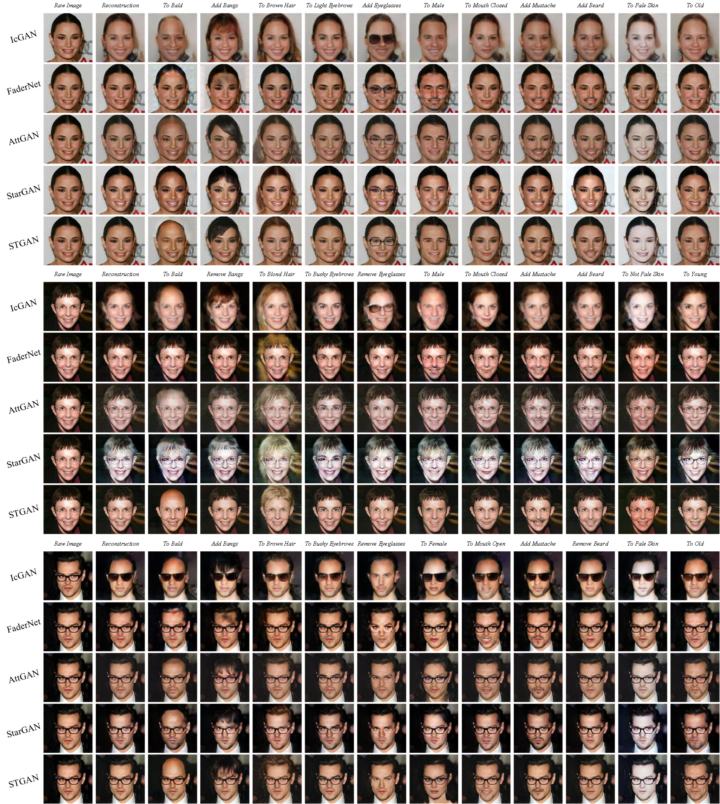
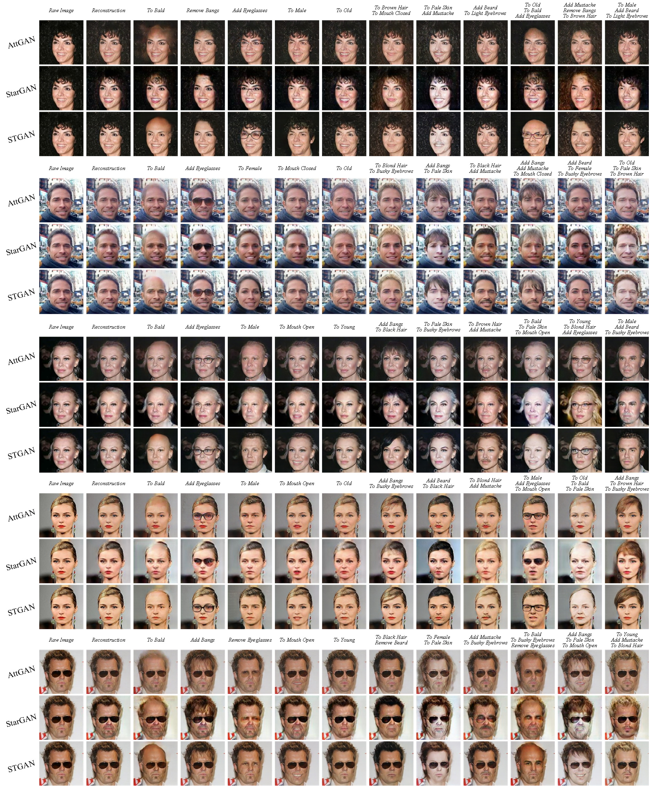
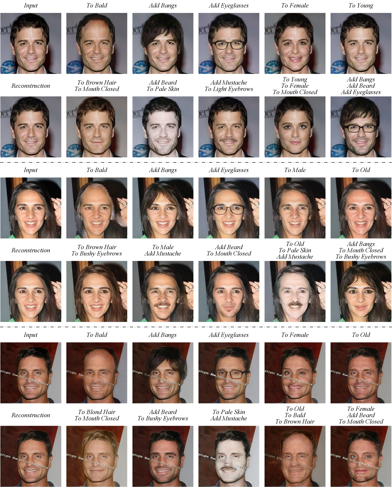
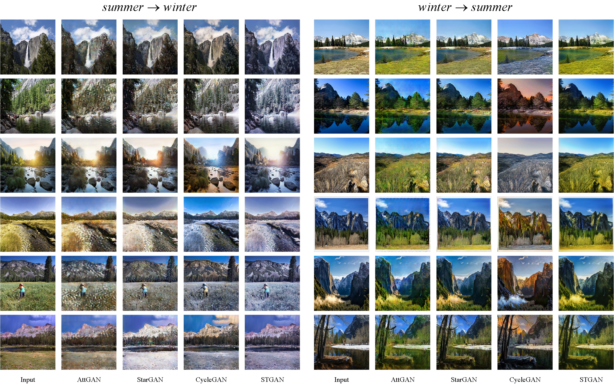

# Facial Attribute Editing

## Single Attribute Editing

 
Facial attribute editing results generated by <a href="https://github.com/Guim3/IcGAN" target="_blank" title="IcGAN@Guim3">IcGAN</a>, <a href="https://github.com/facebookresearch/FaderNetworks" target="_blank" title="FaderNet@facebookresearch">FaderNet</a>, <a href="https://github.com/LynnHo/AttGAN-Tensorflow" target="_blank" title="AttGAN@LynnHo">AttGAN</a>, <a href="https://github.com/yunjey/stargan" target="_blank" title="StarGAN@yunjey">StarGAN</a> and STGAN.

## Complex/Multiple Attributes Editing

 
Facial attribute editing results generated by <a href="https://github.com/LynnHo/AttGAN-Tensorflow" target="_blank" title="AttGAN@LynnHo">AttGAN</a>, <a href="https://github.com/yunjey/stargan" target="_blank" title="StarGAN@yunjey">StarGAN</a> and STGAN.

## High-resolution results

 
High resolution () results of STGAN on facial attribute editing task.

# Season Translation

 
Season translation results by <a href="https://github.com/LynnHo/AttGAN-Tensorflow" target="_blank" title="AttGAN@LynnHo">AttGAN</a>, <a href="https://github.com/yunjey/stargan" target="_blank" title="StarGAN@yunjey">StarGAN</a>, <a href="https://github.com/junyanz/pytorch-CycleGAN-and-pix2pix" target="_blank" title="CycleGAN@junyanz">CycleGAN</a> and STGAN. On the left are results on  task, and on the right are results on  task.

